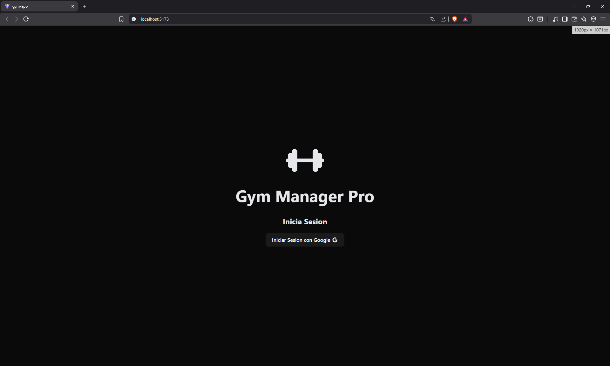
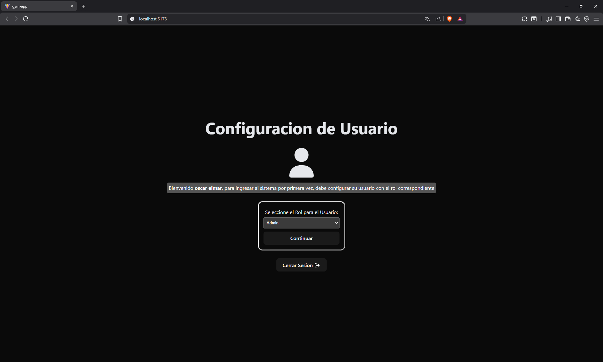
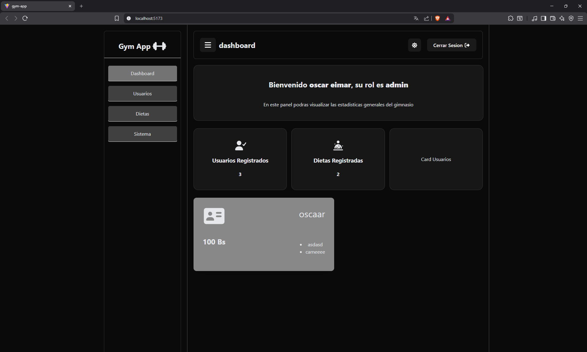
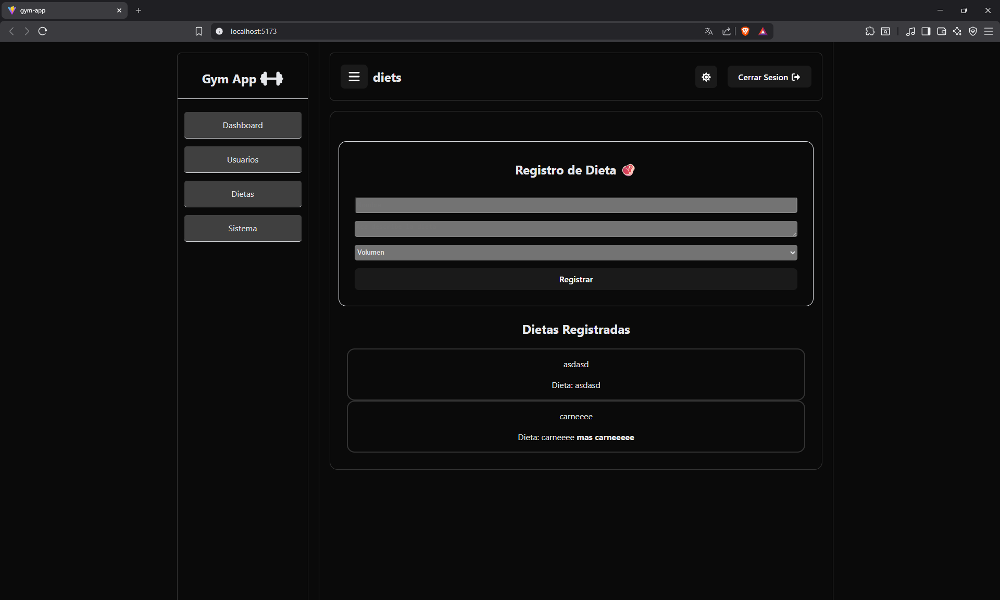

# Proyecto de Diplomado - AppGym

este proyecto es la simulacion de una aplicacion de Gimnasio con autenticacion de firebase e implementacion de contextos en una aplicacion React

## Capturas de pantalla:

### Login

### Wizard User

### Dashboard

### Usuarios

### Dietas

