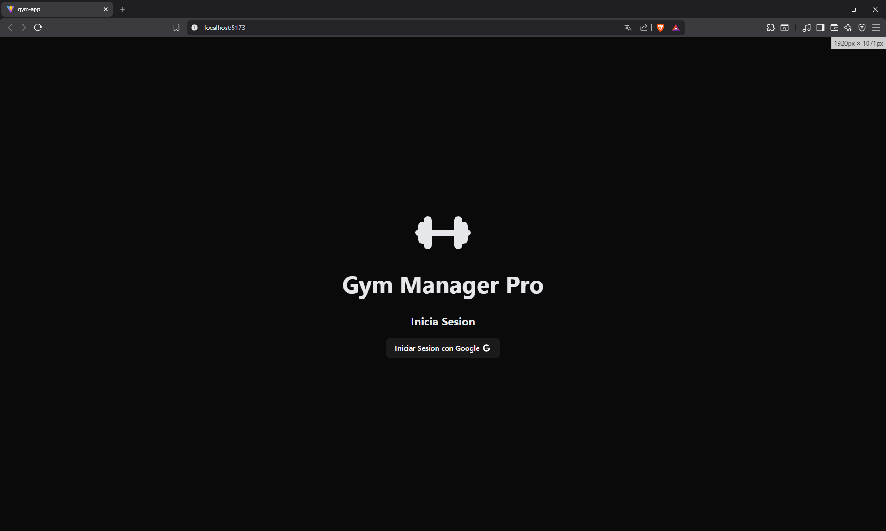
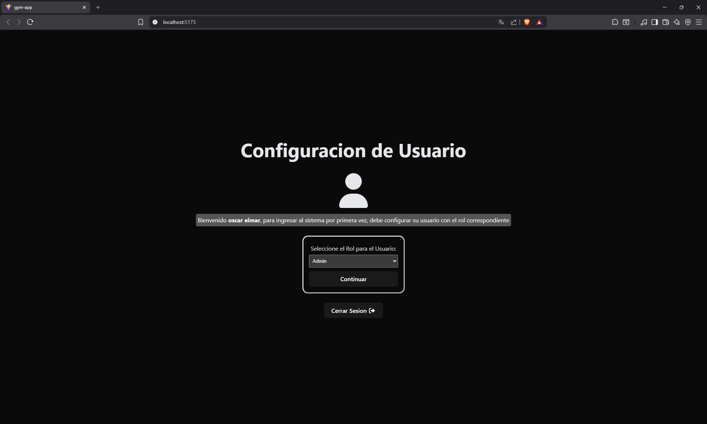
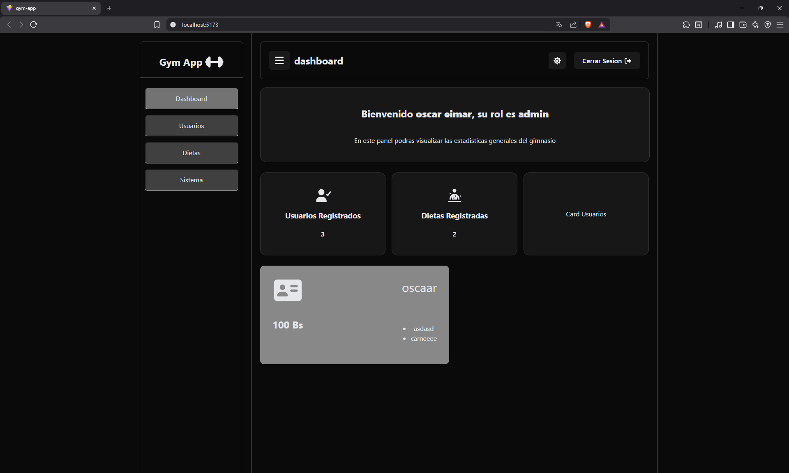
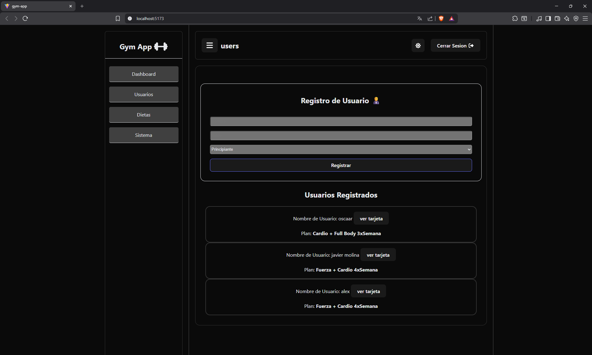
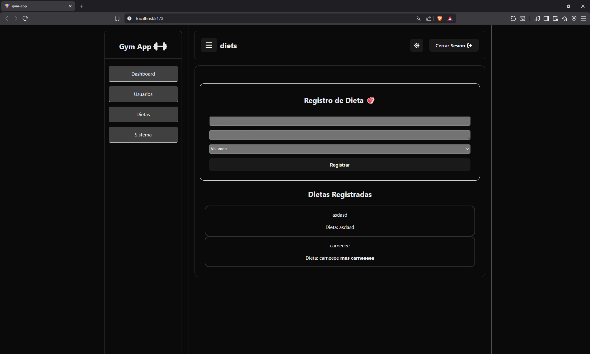

# Proyecto de Diplomado - AppGym

este proyecto es la simulacion de una aplicacion de Gimnasio con autenticacion de firebase e implementacion de contextos en una aplicacion React, almaceniemto local solo en el navegador

## Demo:

Se desplego el proyecto la siguiente url: https://html-flax-mu.vercel.app/

## Capturas de pantalla:

### Login

### Wizard User

### Dashboard

### Usuarios

### Dietas

